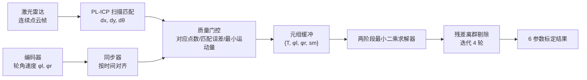
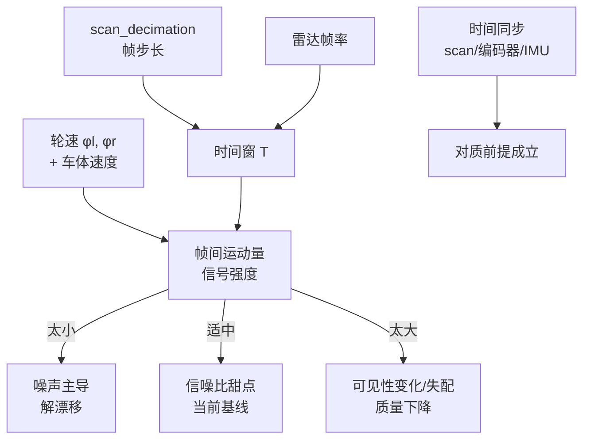
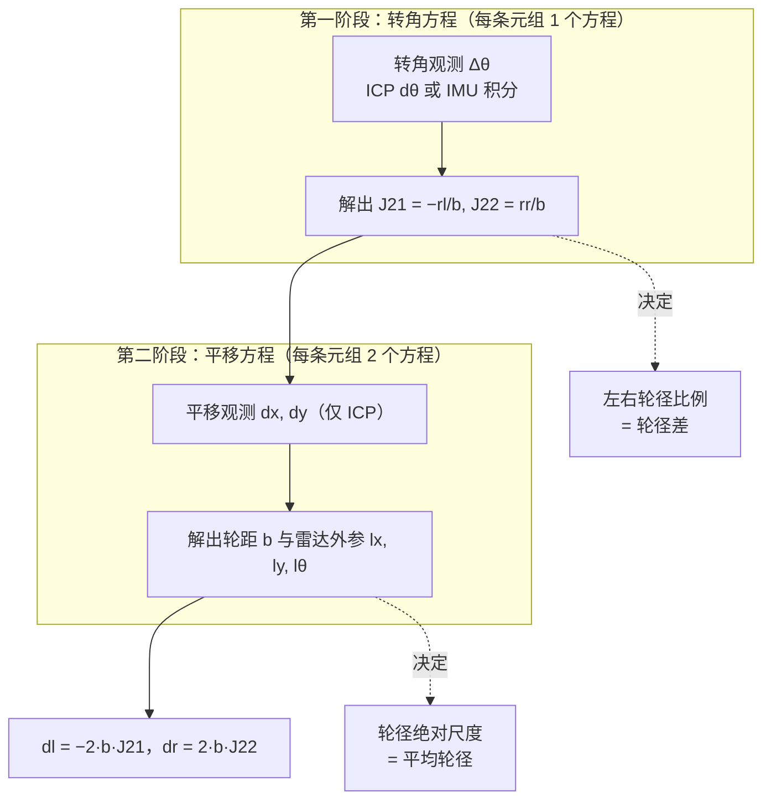

# 激光-轮式里程计联合标定：算法原理与精度提升方案

> 日期：2026-08-21
>
> 适用工程：`laser-odom_calibration` / `OdomLaserCalibraTool`
>
> 第一部分讲解算法原理，假设读者没有标定或机器人学背景；第二部分给出把轮径精度稳定到 0.1 mm 级的工程方案。

---

## 0. 先说清楚：这套方法能到多准，边界在哪里

在深入原理之前，先给结论，避免带着错误预期读下去。本系统（激光 ICP + 轮编码器 + IMU，在线最小二乘）对**轮径**的精度能力边界如下，均由 2026-08 实测数据支撑：

| 指标 | 本系统可达 | 已达/瓶颈 | 超出此限，改算法有用吗 |
|---|---|---|---|
| 平均轮径 | **0.05 ~ 0.1 mm**（约 250~500 ppm） | 当前 +0.10 mm 稳定偏差 | ❌ 到 0.05 mm 后，瓶颈是 ICP 平移尺度偏差和真值源，非算法 |
| 单个轮径（左/右各自） | **0.1 mm**（混合方案） | 当前左 +0.27 mm | ⚠️ 需配合离线锚点法，纯在线改算法不够 |
| 左右轮径**差** | **不可在线分辨**（>0.3 mm） | 偏差 −0.35 mm | ❌ 可辨识性边界，与算法无关 |
| 0.01 mm（50 ppm）每轮 | **不可达** | — | ❌ 物理与真值源双重上限 |

**一句话划界**：这套基于"轮子 vs 激光对质"的方法，其精度下限由两件事钉死——

1. **传感器观测的系统偏差**（ICP 平移尺度偏差 ~0.05%、IMU 转角漂移），它远大于随机噪声，加数据消不掉，改最小二乘形式也消不掉；
2. **真值源的精度**（当前最好的二维码锚点法也只有 0.05 mm 级），验证本身的分辨率到此为止。

**因此：想把单轮稳定到 0.1 mm，是"调参数 + 稳健聚合 + 离线锚点补轮径差"能解决的；想再往下到 0.05 mm 以下、或让在线算法自己分辨轮径差，就不是修改这套算法能解决的，需要换测量原理**（如全站仪 / 激光跟踪仪做外部绝对测量）。这个边界将在第二部分先从估计理论推导（第 7 节），再用实测数据逐条验证。

---

# 第一部分：算法原理（零基础可读）

## 1. 要解决什么问题

我们的机器人是**两轮差速底盘**：左右各一个驱动轮，靠前上方装了一个 2D 激光雷达。机器人要知道自己"走了多远、转了多少"，靠的是轮子上的编码器。但这里有一个麻烦：

**编码器只告诉你轮子转了多少角度，不直接告诉你机器人走了多少距离。**

从"轮子转角"换算到"地面距离"，必须知道轮子的半径：

$$
\text{轮子滚过的距离} = \text{轮子半径} \times \text{轮子转过的角度}
$$

问题是真实轮径并不等于铭牌值。轮胎会磨损、会受压变形、会随温度热胀冷缩，左右两个轮子的磨损程度还不一样。对一台轮径约 200 mm 的机器人，0.3 mm 的轮径误差（仅 0.15%）就会让机器人每直行 10 m 累积 15 mm 的里程误差，并且因为左右误差不同，还会走出一条"自以为直、实际弯"的弧线。

本工具要**自动**标定出以下 6 个参数，不需要人工拿尺子量：

| 参数 | 含义 | 典型值 |
|---|---|---|
| $r_l$ | 左轮有效滚动半径 | ~0.100 m |
| $r_r$ | 右轮有效滚动半径 | ~0.100 m |
| $b$ | 轮距（两轮着地点间距） | ~0.769 m |
| $l_x, l_y$ | 激光雷达相对底盘中心的安装位置 | ~0.50 m, ~0.01 m |
| $l_\theta$ | 激光雷达的安装朝向 | ~$\pi$（朝后安装） |

核心思想一句话：**让"轮子说的运动"和"激光看到的运动"互相对质，矛盾最小化的那组参数就是标定结果。**

## 2. 预备知识：三个基本积木

### 2.1 积木一：差速运动学——两个轮速如何决定机器人运动

设左轮角速度 $\phi_l$、右轮角速度 $\phi_r$（单位 rad/s，由编码器测得），左轮半径 $r_l$、右轮半径 $r_r$，轮距 $b$。

每个轮子滚过地面的线速度 = 半径 × 角速度：

$$
v_l = r_l \phi_l, \qquad v_r = r_r \phi_r
$$

机器人底盘中心的前进速度和转动速度是两轮的组合：

$$
\text{前进速度 } v = \frac{v_l + v_r}{2}, \qquad
\text{转动角速度 } \omega = \frac{v_r - v_l}{b}
$$

直觉理解：

- 两轮同速同向 → $v_l = v_r$ → $\omega = 0$，直行；
- 右轮比左轮快 → $\omega > 0$，向左转弯；
- 两轮等大反向 → $v = 0$，原地打转。

**注意 $b$ 在分母上**：同样的轮速差，轮距越小转得越急。而 $r_l, r_r$ 在分子里：轮径估错，所有推算的距离都按比例错。这就是为什么这三个参数必须标准。

### 2.2 积木二：激光扫描匹配（ICP）——独立于轮子的"运动证人"

激光雷达每转一圈（一帧）得到周围墙壁、柱子的一圈距离点，像一张"环境快照"。机器人在运动中连续拍快照，相邻两帧快照里能看到同一面墙，只是位置略有平移和旋转。

**扫描匹配**（本工具使用 CSM 库的 PL-ICP，点到线迭代最近点算法）做的事就是：把两帧点云反复对齐，找到让点云重合得最好的那个相对运动，输出三个数：

$$
sm = [\, dx,\ dy,\ d\theta \,]
$$

即"从上一帧到这一帧，激光雷达平移了 $(dx, dy)$、旋转了 $d\theta$"。

关键在于：**这个测量完全不经过轮子**。它是用环境几何直接"看"出来的运动，因此可以当作独立证人，去检验轮子那套推算对不对。

> ICP 不是完美的证人，它有毫米级的噪声和微小的系统偏差——这一点会在第二部分成为精度分析的主角。

### 2.3 积木三：最小二乘——从一堆带噪声的方程里榨出最优解

假设有 $N$ 次观测，每次观测给出一个带噪声的方程，例如：

$$
y_k = a \cdot x_k + \text{噪声}, \quad k = 1..N
$$

单次观测定不准 $a$，但把 $N$ 个方程"摞"起来，找让总误差平方和 $\sum_k (y_k - a x_k)^2$ 最小的 $a$，噪声就会互相抵消，$N$ 越大估得越准。这就是最小二乘，本算法的两个阶段本质都是它。

## 3. 核心数据结构：标定元组

系统持续做一件事：每间隔若干帧激光（由 `scan_decimation` 控制），把这段时间窗内的信息打包成一个**元组**：

| 字段 | 含义 | 来源 |
|---|---|---|
| $T$ | 两帧之间的时间间隔（秒） | 激光时间戳 |
| $\phi_l, \phi_r$ | 该时间窗内左右轮的平均角速度（rad/s） | 编码器 |
| $sm = [dx, dy, d\theta]$ | 同一时间窗内激光看到的相对运动 | ICP 扫描匹配 |

一个元组就是一次"对质"：**同一段时间里，轮子说机器人动了多少，激光说机器人动了多少**。如果 6 个参数全都准确，两种说法应该完全一致；不一致的部分，就是参数误差的线索。一次标定会话累积上万条元组（例如 12720 条），用最小二乘从所有矛盾中找出最优参数。

## 3.1 元组的三个输入维度：时间、轮速、scan 如何共同决定标定质量

每条元组的三个字段不是平等独立的，它们之间有几何上的耦合关系。**帧间运动量**是理解一切的中间变量：

$$
\text{帧间运动量} \;=\; \underbrace{\text{速度}}_{\phi_l,\phi_r\ \text{决定}} \times \underbrace{\text{时间窗}}_{T = \text{scan\_decimation} \times \text{帧周期}}
$$

标定要解的方程，本质是"运动"对"参数"的比值。**运动量大 → 信号强 → 传感器固定噪声被稀释；运动量小 → 信号弱 → 噪声主导 → 解漂。** 三个维度正是通过控制"运动量"和"观测质量"影响最终结果：

### （1）scan 帧与时间窗 $T$：信噪比的直接旋钮

`scan_decimation` 决定每隔几帧激光配一次对。雷达帧周期约 50 ms，所以：

| scan_decimation | 时间窗 $T$ | 帧间平移（0.04 m/s 下） | 效果 |
|---|---|---|---|
| 1 | ~50 ms | ~2 mm | 运动量与 ICP 固有噪声（毫米级）相当，**信噪比最差**，尺度易偏 |
| 3 | ~150 ms | ~6 mm | **当前推荐基线**，信号/噪声比合适 |
| 5 | ~250 ms | ~10 mm | 运动量更大但可见性变化、轮速近似的误差和失配增大，反而变坏 |

历史离线实验（[README_final_calibration_report_zh.md](archive/README_final_calibration_report_zh.md)）实测了这三档：scan_step=1 轮径严重偏小、step=5 也偏、**step=3 最优**。原因正是"信噪比"和"观测质量"在两端同时恶化，中间存在甜点。

### （2）轮速 $\phi_l, \phi_r$：既是信号载体，也是模型假设的来源

轮速有双重身份，对结果的影响也分两面：

- **作为被标定的输入**：轮速编码器的刻度误差、时间戳抖动会直接进入 $\phi_l T$（轮角增量），这是第一、二阶段方程的"已知数"，它的错误会 1:1 传递给轮径。
- **作为运动量的来源**：$\phi_l T$、$\phi_r T$ 太小意味着机器人近似静止。这就是 `min_wheel_motion=0.01 rad` 门控的意义——静止帧 ICP 往往"看起来匹配得很好"（对应多、误差低），但**它不含任何运动信息**，大量静止元组只会稀释有效数据，让解往"无运动也能自洽"的方向漂。

> 关键点：算法假设 $\phi_l, \phi_r$ 在时间窗 $T$ 内**近似恒定**（用平均角速度代表整窗）。机器人加减速越平缓、窗越短，这个假设越成立；急加速/急刹车时窗内的平均速度代表性变差，引入近似误差。这也是低速（0.04 m/s）标定的原因。

### （3）时间 $T$ 与同步：所有通道对质的公共基准

- **帧间时长**：同（1），决定运动量；
- **跨传感器时间同步**：激光时间戳、编码器时间戳、IMU 时间戳必须对齐到同一时刻，否则"轮子说的运动"和"激光看到的运动"根本不是同一段时间，对质的前提就垮了。毫秒级的时间偏差在旋转阶段会直接污染第一阶段的转角方程。

### 三者耦合的总图

**一句话总结**：标定精度 = 信号（运动量，由速度和帧步长共同决定）÷ 噪声（传感器固有），再乘以"对质是否在同一时间段"（时间同步）。当前低速场景下，scan_decimation=3、min_wheel_motion=0.01、低速匀速，就是把这三个维度都调到了信噪比甜点上。

### 3.2 举一反三：两个典型偏差场景量化分析

理解了上面的"信号/同步"框架，就能自己推算"如果 X 偏了会怎样"。核心方法是问三个问题：

1. 这个偏差作用在**哪条通路**——转角（决定比例）、平移（决定尺度）、还是时间同步（对质前提）？
2. 它传播给结果的**比例**是多少？
3. 相对目标精度（0.1 mm / 200 mm ≈ 0.05% = 500 ppm），它超标了吗？

**场景 A：轮速输入偏大 10%（编码器刻度标错 10%）**

- 作用通路：轮速 $\phi$ 是方程的"已知数"，同时进转角和平移两条通路。
- 传播：转角方程 $\Delta\theta = T(J_{21}\phi_l + J_{22}\phi_r)$，若 $\phi$ 整体乘 1.1，为保持等式，解出的 $J_{21}, J_{22}$ 整体除以 1.1 → $b$ 不变、**轮径整体缩小 10%**（轮径 = $b \cdot J$）。第二阶段的 $b$ 由平移定尺度，但 $J$ 错了，轮径就跟着错。
- 定量：轮径误差 **−10% ≈ −20000 ppm**，是 500 ppm 目标的 40 倍。**结论：10% 轮速误差是灾难性的，直接报废。**（注：当前用 `/encoder_values` 原始 tick + 每转 150000 的精确刻度，就是为消除这种刻度误差。）

**场景 B：激光与编码器时间戳差 100 ms（同步偏差）**

- 作用通路：时间同步——"轮子说的运动"和"激光看到的运动"不再是同一段时间。
- 传播：机器人 0.04 m/s 下，100 ms 内轮子走了 $0.04 \times 0.1 = 4$ mm，但激光记录的是 100 ms 之前/之后的运动。元组里"轮角增量 $\phi T$"与"激光位移 $sm$"错开 4 mm。这个错位直接进入第一、二阶段方程的左右两边。
- 定量：帧间运动量本身才约 6 mm，错开 4 mm 意味着**每条元组的信号被污染 ~70%**，且转角阶段（旋转时）会把固定时间差解释成虚假的轮速差 → **左右轮径比例被扭曲**。100 ms 是当前系统的**致命量级**（目标是毫秒级同步）。

**对比：偏差的"敏感度"完全不同**

| 偏差 | 作用通路 | 对轮径的影响 | 相对 0.1mm 目标 |
|---|---|---|---|
| 轮速 +10% | 转角+平移（刻度） | 轮径 −10% | 超标 40 倍，致命 |
| 时间戳差 100 ms | 同步 | 信号污染 ~70% + 比例扭曲 | 致命 |
| 轮速 +0.05% (500ppm) | 刻度 | 轮径 −0.05% | 恰好在 0.1mm 边界 |
| 时间戳差 1 ms | 同步 | 信号污染 ~0.7% | 可忽略 |

**规律**：轮速和时间同步的"容许误差"都以 **ppm / ms** 计，因为帧间运动量本身只有毫米级。任何让"已知数失真"或"对质错时"的因素，都会被这个微小的运动量放大成巨大的相对误差。这就是为什么系统对编码器刻度、时间同步的要求远高于对 ICP 单帧精度的要求。

## 4. 两阶段求解：先定比例，再定尺度

这是整个算法最精妙的设计（源自 Censi 等人 2013 年的方法）。6 个参数不是一次性混着解的，而是拆成两步，每一步都是一个干净的最小二乘问题。

### 4.1 第一阶段：只用"转角"方程，解出左右轮径**比例**

对每条元组，把 2.1 节的转动公式在时间窗 $T$ 上积分，得到"轮子推算的转角"：

$$
\Delta\theta_{\text{轮子}} = \omega \cdot T = \frac{r_r \phi_r - r_l \phi_l}{b} \cdot T
$$

把常数归并一下，定义两个中间量：

$$
J_{21} = -\frac{r_l}{b}, \qquad J_{22} = \frac{r_r}{b}
$$

于是每条元组给出一个方程（负号只是左右轮转向的符号约定，不影响理解）：

$$
\underbrace{\Delta\theta_{\text{观测}}}_{\text{激光 } d\theta \text{ 或 IMU 积分}} = T \left( J_{21}\, \phi_l + J_{22}\, \phi_r \right) + \text{噪声}
$$

$N$ 条元组摞起来，对 $J_{21}, J_{22}$ 做最小二乘即得解。

**为什么这一步只能得到比例？** 看这两个中间量的比值：

$$
\frac{J_{22}}{-J_{21}} = \frac{r_r}{r_l}
$$

$J_{21}$ 和 $J_{22}$ 各自都是"轮径 / 轮距"的比值。转角是一种"无量纲"的观测量——机器人原地打转时，无论轮子整体偏大还是轮距整体偏小，只要按比例同步缩放，转角都一样。所以**转角方程天然分不清"轮径和轮距谁错了"，只确定左右轮的相对大小**。

> 直觉：让机器人原地打转，你能听出"哪个轮子更大"，但听不出"两个轮子具体多大"。

### 4.2 第二阶段：用"平移"方程，解出绝对尺度和雷达外参

平移能补上尺度，因为平移有量纲（米）。机器人沿弧线运动时，底盘中心在一个扫描间隔内的位移（精确圆弧积分）为：

$$
\begin{bmatrix} \Delta x \\ \Delta y \end{bmatrix}_{\text{底盘}}
= b \cdot \begin{bmatrix} c_x \\ c_y \end{bmatrix}
$$

其中 $c_x, c_y$ 是只由已解出的 $J_{21}, J_{22}$、轮速 $\phi_l,\phi_r$、时间 $T$ 和转角 $\Delta\theta$ 算出来的已知数：

$$
c_x = \tfrac{T}{2}\left(-J_{21}\phi_l + J_{22}\phi_r\right) \frac{\sin\Delta\theta}{\Delta\theta},
\qquad
c_y = \tfrac{T}{2}\left(-J_{21}\phi_l + J_{22}\phi_r\right) \frac{1-\cos\Delta\theta}{\Delta\theta}
$$

可以看到 $b$ 作为一个**整体乘数**站在平移前面——平移有多大，直接暴露 $b$ 有多大。

但还有一个障碍：激光雷达不在底盘中心，它装在 $(l_x, l_y)$、朝向 $l_\theta$。底盘动了，雷达感受到的运动要做一个坐标变换：雷达的观测 = 底盘平移（转到雷达朝向）+ 雷达因绕底盘中心旋转而产生的杠杆臂位移：

$$
sm \;\approx\; R(l_\theta)^{\top} \Big[ \underbrace{\big(R(\Delta\theta) - I\big)\, l}_{\text{杠杆臂项}} + \underbrace{b \begin{bmatrix} c_x \\ c_y \end{bmatrix}}_{\text{底盘平移}} \Big]
$$

第二阶段就把每条元组整理成关于未知向量

$$
x = \big[\, b,\; l_x,\; l_y,\; \cos l_\theta,\; \sin l_\theta \,\big]^{\top}
$$

的齐次线性方程 $L_k x \approx 0$，摞起所有元组最小化 $\sum_k \|L_k x\|^2$，并带上约束 $\cos^2 l_\theta + \sin^2 l_\theta = 1$（保证解出的确实是一个合法角度）。这个带约束的问题通过拉格朗日乘子化成一个关于 $\lambda$ 的一元二次方程，两个候选解里取残差更小的那个（见 [src/solver.cpp](../src/solver.cpp) 的 `full_calibration_min`）。

### 4.3 两步汇合：轮径的最终表达式

第二阶段解出轮距 $b$ 之后，与第一阶段的 $J_{21}, J_{22}$ 相乘，半径（和直径）就唯一确定了：

$$
d_l = 2 r_l = -2\, b\, J_{21}, \qquad d_r = 2 r_r = 2\, b\, J_{22}
$$

至此 6 个参数全部解出。整个流程没有迭代优化、没有初值敏感问题，每个阶段都是一次性的闭式最小二乘。

### 4.4 一图看懂：哪个观测决定哪个参数

这张图是整个精度分析的钥匙：

- **左右轮径比例**（差值、比值）只由第一阶段的**转角观测**决定；
- **平均轮径尺度**由第二阶段的**平移观测**决定（通过 $b$ 传递）。

两条误差通路互不相同，后面会看到它们的精度表现和瓶颈完全不同。

## 5. 求解前后的配套机制

### 5.1 元组质量门控（进入求解器之前）

不是每个元组都有资格参与标定。以下情况的元组会被丢弃：

- ICP 有效对应点数 `nvalid` 太少（< 300）：环境特征不足，位姿不可信；
- 每个有效点的平均匹配误差太大（> 5 mm）：匹配质量差；
- 帧间轮子运动量太小（< 0.01 rad）：机器人近似静止。静止帧的 ICP 往往"看起来很好"（对应多、误差低），但它不含任何运动信息，大量混入只会稀释有效数据。

### 5.2 扫描去畸变（deskew）

2D 激光雷达不是"瞬时拍照"：一帧内的每条光束是在不同时刻采集的（本雷达一帧约几十毫秒）。如果机器人在采集期间正在移动或转动，同一帧内的点其实来自不同的机器人位置，远端墙面会被"拉弯"。deskew 按每条光束的采集时刻，用估计的运动速度把点变换回同一时刻，再交给 ICP。它改善单帧内部的几何一致性，从而改善 ICP 的观测质量。

### 5.3 残差离群剔除（求解之后）

求解完成后，用当前参数回算每条元组的"轮子预测运动"，与激光观测对比得到残差。把平移残差或转角残差排在最差的约 1% 的元组剔除，用剩下的元组重新求解；如此迭代 4 轮（`final_outlier_iterations`）。这能把偶发的坏匹配（动态障碍物、玻璃反射等）从数据集里洗掉。

### 5.4 在线化包装

原始算法是离线批处理；在线节点（[src/online_calibrator_node.cpp](../src/online_calibrator_node.cpp)）的做法是：

- 实时累积元组，每新增 20 条合格元组（或每 2 秒）重跑一次完整批求解，发布 `/result`（基于最近 5000 条的滑动窗口，看趋势）；
- 每个完整动作周期结束后，用会话开始以来的**全部**元组发布 `/final_result`（看精度），并单独用每个周期自己的元组发布 `/single_cycle_result`（看独立重复性）；
- 同时输出拟合轨迹 `pos_fit` 与激光轨迹 `pos_loc`、残差标记等，供绘图节点可视化。

### 5.5 转角观测的"可替换信源"设计

第一阶段需要的只是"这两帧之间机器人转了多少"，这个观测有两个可选来源：

| 来源 | 说明 | 现状 |
|---|---|---|
| ICP 的 $d\theta$ | 原始算法路径 | 历史发现它对转弯运动有微小系统偏差，会把左右轮径比例解反 |
| IMU 角速度积分 | `use_imu_yaw_for_calibration=true`，按时间戳积分陀螺 z 轴 | **当前基线**，切断 ICP 转角偏差的传递链 |

第二阶段必须保留 ICP 的 $dx, dy$（IMU 给不了平移），所以激光链路始终在工作。

## 6. 怎么读标定结果里的"残差"和"不确定度"

结果表中的平移残差 RMS（约 0.43 mm）、每米标准误差（约 0.085）衡量的是：**当前参数下，轮子模型和激光观测彼此有多自洽**。自洽是必要条件，不是充分条件——残差低只说明模型内部没有矛盾，不能证明参数等于物理真值（如果激光观测本身带系统性偏差，模型会把偏差吸收进参数里，残差照样很低）。同理，程序打印的 FIM 不确定度是在"模型完全正确"假设下的统计界限，偏差不计入其中。

记住这句话，是理解第二部分的前提：**这套系统的精度瓶颈从来不是随机噪声，而是观测通道的系统偏差。**

---

# 第二部分：精度提升方案（目标：每轮稳定 0.1 mm）

## 7. 理论依据：精度边界的估计理论推导（不依赖实测数据）

第 0 节的边界表是实测结论。本节回答一个更根本的问题：**这些边界是本次实验碰巧如此，还是算法结构上注定如此？** 用估计理论推导一遍，会看到两者完全互洽。

### 7.1 最小二乘误差的代数分解：随机项可压，偏差项钉死

以第一阶段为例。记每元组左右轮的转角增量向量 $L_i = T_i[\phi_{l,i},\ \phi_{r,i}]^{\top}$，观测 $y_i = \Delta\theta_i$，信息矩阵 $A=\sum_i L_i L_i^{\top}$，则最小二乘解的误差为

$$
\hat J - J = A^{-1}\sum_i L_i\,\varepsilon_i
= \underbrace{A^{-1}\sum_i L_i\,\varepsilon^{\text{rand}}_i}_{\text{随机项}} + \underbrace{A^{-1}\sum_i L_i\,\varepsilon^{\text{sys}}_i}_{\text{偏差项}}
$$

- **随机项**：$\text{Cov}(\hat J)=\sigma_\theta^2 A^{-1}$。$A$ 随元组数 $N$ 线性增长，标准差按 $1/\sqrt N$ 下降——"数据越多越准"说的只是这一项；
- **偏差项**：若观测偏差是**与运动相关的乘性偏差**（如 ICP 把平移尺度系统性放大 $\kappa$ 倍），则 $\varepsilon^{\text{sys}}_i \approx \kappa\, y_i$，代入得 $\hat J - J \approx \kappa J$——**一个不随 $N$ 减小的常数**。

推论：**"加数据消不掉系统偏差"不是经验总结，是恒等式。** 数据只对随机项有效。

### 7.2 Cramér–Rao 下界：当前随机误差已贴近理论极限

Fisher 信息 $F = A/\sigma_\theta^2$，任何无偏估计满足 $\text{Cov} \succeq F^{-1}$（CRB）。代入本系统量级（每元组转角观测噪声 $\sigma_\theta \approx 0.5$ mrad、轮转角增量 $L \approx 0.06$ rad、每周期 $N \approx 900$）：

- **轮径差**：$\sigma(d) = 2b\,\sigma_\theta\sqrt{u^{\top}A^{-1}u}$（$u=[-1,1]^{\top}$），按最保守的全直行激励估算约 **0.6 mm**；实际动作含大量转弯、差模激励更强，实测单周期 σ=0.13 mm 落在界内；
- **轮距/尺度**：$\sigma(b) = \sigma_{xy}\big/\sqrt{\sum_i s_i^2}$，代入 $\sigma_{xy}\approx0.49$ mm、帧间平移 $s\approx6$ mm、$N=11766$ 得约 **0.75 mm**，实测轮距单周期 σ=0.86 mm——**几乎贴着理论下界**。

结论：随机误差已压在 CRB 附近，**改算法形式没有可榨的余地**；继续加数据，触及的是 7.1 的偏差项天花板。

### 7.3 可辨识性：轮径差为什么"原则上"不可在线分辨

参数可辨识 $\iff$ 信息矩阵满秩（最小特征值显著大于噪声底）。据此逐条推：

1. **纯转角观测下尺度不可辨识**（两阶段设计存在的理论理由）：$(r_l, r_r, b)$ 同乘任意 $\lambda$，转角方程不变 → 信息矩阵在该方向存在零特征值 → 必须引入有量纲的平移观测才能定尺度；
2. **陀螺零偏与左右比例近线性相关**：把零偏列为第三回归量 $[T\phi_l,\ T\phi_r,\ T]$，匀速转弯段 $T\phi_l \approx c_l T$、$T\phi_r \approx c_r T$——第三列几乎落在前两列张成的平面内，信息矩阵病态（代码中 `max_cond_number=75` 的防护正为此而设）→ 零偏与比例的分配近乎任意，这就是 `estimate_imu_yaw_bias` 默认关闭的理论原因；
3. **比例信号 vs 零偏噪声的信噪比**：轮径差 0.18% 对应的每元组转角信号 $\approx T\cdot\delta J\cdot\phi \approx 0.15 \times 2.3\times10^{-4} \times 0.4 \approx 1.4\times10^{-5}$ rad；而典型 MEMS 零偏 $10^{-3}$ rad/s 在每元组积分出 $1.5\times10^{-4}$ rad——**信号被淹没约 10 倍，且零偏是系统性的、不随 $N$ 平均掉**。理论上即预言"轮径差解会被零偏拖走"，实测 −0.35 mm 级偏差正是这一表现；
4. **ICP 平移的乘性尺度偏差 $\kappa$**：点到线 ICP 在噪声与离散采样下存在 $10^{-4}\sim10^{-3}$ 量级的尺度偏差是已知现象。由 7.1，它原样变成平均轮径的相对偏差 $\delta d/d = \kappa$。取 $\kappa \approx 500$ ppm 即预言平均轮径偏差 $\approx 0.10$ mm——与实测 $+0.101$ mm 吻合。

### 7.4 于是第 0 节的边界是结构性的

| 指标 | 理论机制 | 理论下限 | 实测 | 互洽 |
|---|---|---|---|---|
| 平均轮径 | $\text{MSE}=\kappa^2+\text{Var}$，Var 可压、$\kappa\approx500$ ppm 不可压 | ~0.1 mm | +0.101 mm | ✓ |
| 轮径差 | 信号/零偏 ≈ 1/10 且为系统性 + 信息矩阵病态 | 不可分辨 | 偏差 −0.346 mm | ✓ |
| 0.01 mm/轮 | 需 $\kappa<50$ ppm，观测链路无此机制；真值源仅 250 ppm 级 | 不可达 | — | ✓ |

**理论与数据互为印证，说明这些边界由观测结构决定，而不是某次实验的偶然。** 这正是第 0 节"改算法无用、需换测量原理"的理论依据。

## 8. 现状：2026-08-21 实测数据的定量分解

同一会话 13 个相互独立的动作周期（每周期约 900 条内点元组，IMU 转角基线配置）统计：

| 指标 | 周期均值 | 单周期 σ | 13 周期均值 SEM | 真值 | **系统偏差** |
|---|---|---|---|---|---|
| 左轮径 | 200.039 mm | 0.133 mm | 0.037 mm | 199.765 mm | **+0.274 mm** |
| 右轮径 | 200.051 mm | 0.161 mm | 0.045 mm | 200.123 mm | **−0.072 mm** |
| 平均轮径 | 200.045 mm | 0.132 mm | 0.037 mm | 199.944 mm | **+0.101 mm** |
| 轮径差（右−左） | +0.012 mm | 0.130 mm | 0.036 mm | +0.358 mm | **−0.346 mm** |
| 轮距 | 768.92 mm | 0.86 mm | 0.24 mm | — | — |

三个事实：

1. **随机分量已经足够好**：整场解的统计不确定度约 0.037 mm，远在 0.1 mm 之内。加数据、加周期不再有收益。
2. **平均轮径带 +0.10 mm 稳定偏差**：ICP 平移尺度被估大约 0.05%，它稳定存在，是系统偏差。
3. **轮径差完全没解出来**：均值 +0.012 mm vs 真值 +0.358 mm，偏差 −0.346 mm，是统计噪声的 10 倍。第一阶段（IMU 积分）无法分辨 0.18% 量级的左右比例差。

左右轮周期误差相关系数 r ≈ 0.62 —— 主导噪声是**共模尺度噪声**（ICP 平移漂移），这决定了杠杆应该加在平移通道上。

## 9. 误差的数学结构：为什么单轮精度绕不开两件事

轮径天然分解为"平均尺度 m"和"半差 d/2"：

$$
D_l = m - \frac{d}{2}, \qquad D_r = m + \frac{d}{2},
\qquad m = \frac{D_l + D_r}{2},\quad d = D_r - D_l
$$

误差同样分解：

$$
\text{err}_l = \text{err}_m - \frac{\text{err}_d}{2}, \qquad
\text{err}_r = \text{err}_m + \frac{\text{err}_d}{2}
$$

**每轮都达到 0.1 mm 的充要条件：**

$$
\left|\text{err}_m\right| + \frac{|\text{err}_d|}{2} \;\le\; 0.1 \text{ mm}
$$

即：平均轮径误差和轮径差误差**必须分别被压下去**，没有任何单一手段能同时解决两者——它们由第一部分图 4.4 所示的两条独立通路决定。

| 目标 | 判定 | 原因 |
|---|---|---|
| 0.01 mm 每轮 | 不可达 | 需要 ICP 尺度偏差与 IMU 比例分辨同时优于 50 ppm，超出传感器物理能力；且真值源本身只有 0.05 mm 级 |
| 0.1 mm 平均轮径 | 可达 | 偏差 +0.10 mm 已在边界，收紧 ICP + 稳健聚合 + 固化修正即可 |
| 0.1 mm 每轮 | 可达（混合方案） | 在线管尺度、离线锚点管轮径差 |
| 0.1 mm 纯在线轮径差 | 不可达 | 可辨识性边界：轮编码器 + ICP/IMU 无法分辨 0.18% 比例差，已三次独立实验确认 |

## 10. 杠杆一：收紧 ICP 平移质量（压平均轮径偏差，主战场）

在 [launch/online_calibrator.launch](../launch/online_calibrator.launch) 调整：

| 参数 | 当前 | 建议 | 作用 |
|---|---|---|---|
| `max_correspondence_dist` | 0.30 | **0.15** | 对匹配精度影响最大；0.30 在墙角/边缘易产生方向错误的远对应，直接拉偏平移尺度 |
| `max_scan_match_error_per_valid` | 0.005 | **0.002** | 只放行进每点误差 ≤2 mm 的高质量 ICP 帧 |
| `min_scan_match_nvalid` | 300 | 500 | 对应点更充足的帧，位姿估计更稳 |
| `max_reading` | 15.0 | 10.0 | 远点噪声大且稀疏，10 m 内结构足够时应裁掉 |
| `scan_sigma` | 0.010 | 按雷达规格书核对 | `use_sigma_weights=1` 时直接决定近/远点权重分配 |

代价是合格元组减少，需要更长采集时间补偿；以当前约 92% 的内点率，余量充足。

## 11. 杠杆二：周期级稳健聚合（便宜且立竿见影）

13 周期数据显示质量与估计正相关：每米误差最高的周期 12（0.0949）轮径也最高（双轮 +0.2/+0.3 mm）。

- 剔除每米误差 > 0.09 的周期后，平均轮径偏差从 +0.101 mm 降到 **+0.079 mm**；
- 或改用周期**中位数**代替均值，偏差 +0.091 mm，且天然抗离群。

建议最终值取"质量门控后的周期中位数"，而不是单条 final_result。

## 12. 杠杆三：固定尺度修正（"标定的标定"，可选兜底）

若做完杠杆一、二后残余偏差仍稳定存在（例如 +0.05~0.08 mm），可乘一个固定系数归零：

$$
k = \frac{m_{\text{真值}}}{m_{\text{标定}}} \approx \frac{199.944}{200.04} \approx 0.9995
$$

**固化前提（必须全部满足）：**

1. 在 ≥5 个不同日期的独立 session（重新上电、重启节点）中验证偏差稳定，漂移 ≤0.03 mm；
2. 每次 session 只取最终一条结果，不用同 session 内的累积周期充当独立样本（它们强相关）；
3. 承认真值端限制：当前真值来自二维码锚点法，自身不确定度 0.05 mm 级，修正系数的可信度以此为限。

## 13. 轮径差：离线锚点固化（混合方案，不可在线替代）

在线分辨轮径差已被证伪（偏差 −0.346 mm，且多次实验复现）。但轮径差是**物理量**，可离线一次测准后固化：

1. 用 [scripts/qr_distance_calibration.py](../scripts/qr_distance_calibration.py) 锚点直行法：机器人对准起点二维码、直行 3 m 到终点二维码，用轮角增量反解每侧轮径。正反向各测 3 次取均值，轮径差精度 **0.05 mm 级**；
2. 在线系统只负责输出平均轮径 $m$；
3. 后处理合成单轮：$D_l = m - d_{\text{anchor}}/2$，$D_r = m + d_{\text{anchor}}/2$。

**失效条件与监控**：轮胎换位、补气、换胎、载荷大改、温度剧变都会使固化值失效。每 1~2 周用锚点法复测一次轮径差（每次约 3 分钟）；同时长期跟踪在线标定的轮径差——它的绝对值不可信，但**变化量**可作为轮胎状态变化的报警信号。

## 14. 环境控制（0.1 mm 目标的物理预算）

| 项目 | 敏感度 | 控制要求 |
|---|---|---|
| 温度 | 橡胶轮径约 0.02 mm/°C | 标定窗口内 ±2°C；固定时段、记录室温 |
| 载荷 | 胎压/形变改变有效轮径 | 每次标定保持相同载重 |
| 胎压（充气胎） | 直接影响有效半径 | 记录气压，补气后重测轮径差 |
| 地面 | 摩擦特性影响打滑率，进入尺度 | 固定标定场地 |
| 真值源 | 二维码锚点法 ±0.05 mm 级 | "误差 0.1 mm"的验证不能比真值源更精细 |

## 15. 合成误差预算（最终核算）

| 分量 | 预算 |
|---|---|
| 平均轮径（杠杆一 + 二 + 三后） | ±0.05 mm |
| 轮径差一半（锚点法） | ±0.025 mm |
| 温度漂移（±2°C，共模+差模） | ±0.02 mm |
| **单轮合成（RSS）** | **≈ ±0.06 mm** |
| 单轮最坏情况（直接相加） | ≈ ±0.095 mm |

对照现状（左轮 +0.274 mm），预计左轮降至约 0.06 mm、右轮约 0.05 mm，**双轮进入 0.1 mm**。

## 16. 验收协议

1. 按第 10 节更新 launch 参数并冻结配置（任何改动后重新验收）；
2. 跑 1 个会话采集 ≥10 个动作周期，用周期质量门控 + 中位数聚合出当次结果；
3. 跨 ≥5 天做 ≥5 次独立 session，统计平均轮径的 session 间 σ ≤ 0.03 mm；
4. 满足后固化尺度修正系数 $k$；
5. 每 1~2 周锚点法复测轮径差，漂移超 0.05 mm 则更新固化值并检查轮胎状态。
